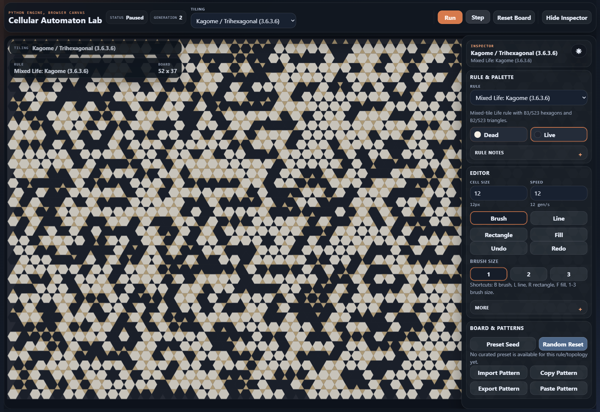
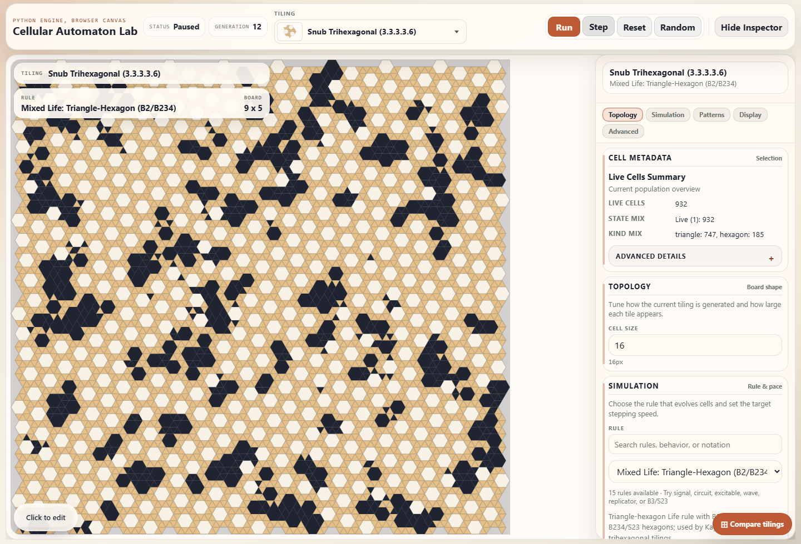
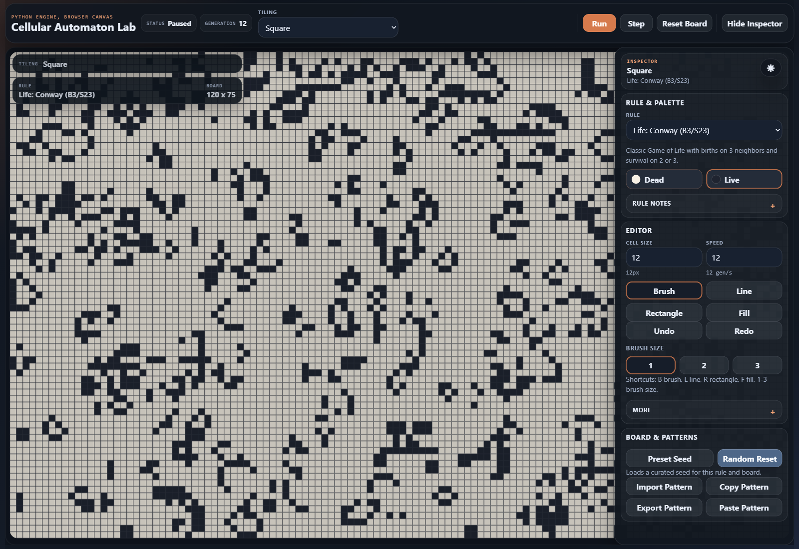
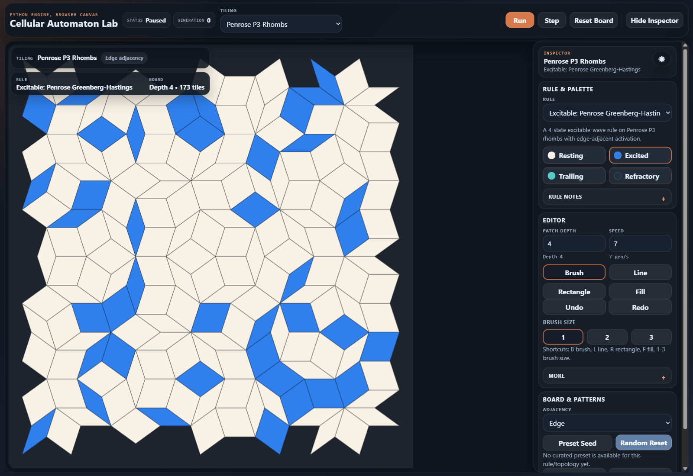

# Cellular Automaton Lab

Cellular Automaton Lab is a browser-based cellular automata playground built around topology-first boards. It supports classic lattices, periodic mixed tilings, and finite aperiodic patches in one app, with a Flask backend and a Vite-built TypeScript frontend.

Live standalone demo: [https://grgs.github.io/cellular-automaton-lab/](https://grgs.github.io/cellular-automaton-lab/)



## Highlights

- 15 tiling families across square, hex, triangle, Archimedean, Cairo, Penrose, and Ammann-Beenker boards
- 16 built-in rules spanning Life-like, mixed-tiling, excitable, and signal systems
- one shared `next_state(ctx)` rule protocol across all shipped topologies
- canvas-first editing with brush, line, rectangle, fill, undo/redo, presets, and pattern import/export
- sparse pattern persistence keyed by stable topology cell IDs
- TypeScript frontend in `frontend/` with Vitest unit tests and Playwright browser coverage

## Screenshots

### Snub Trihexagonal mixed-tiling board with the inspector open



### Square board with Conway after several generations



### Penrose P3 Rhombs with patch-depth controls



## What Makes It Different

- The simulation model is topology-first, not grid-first.
- The backend is authoritative; the browser renders snapshots and sends explicit mutations.
- Regular, mixed periodic, and aperiodic boards share one rule protocol and one editing workflow.
- Pattern files use sparse `cells_by_id` payloads instead of dense grid-only formats.

Architecture details live in [docs/ARCHITECTURE.md](docs/ARCHITECTURE.md).

## Included Rules

- Life-like: `conway`, `highlife`, `life-b2-s23`, `hexlife`, `trilife`
- Mixed-tiling Life: `archlife488`, `archlife-3-12-12`, `archlife-3-4-6-4`, `archlife-4-6-12`, `archlife-3-3-4-3-4`, `archlife-3-3-3-4-4`, `archlife-3-3-3-3-6`, `kagome-life`
- Excitable: `penrose-greenberg-hastings`, `whirlpool`
- Signal/circuit: `wireworld`

## Running Locally

1. Install Python dependencies:

```powershell
py -3 -m pip install -r requirements.txt
```

2. Install frontend dependencies:

```powershell
npm install
```

3. Build the frontend bundle:

```powershell
npm run build:frontend
```

4. Start the app:

```powershell
py -3 .\app.py
```

5. Open [http://127.0.0.1:5000](http://127.0.0.1:5000)

The server respects `HOST`, `PORT`, and `APP_INSTANCE_PATH`. If `static/dist/manifest.json` is missing, startup fails with a message telling you to run `npm run build:frontend`.

## Frontend Workflow

The authored frontend source lives in `frontend/`. Vite builds hashed runtime assets and `manifest.json` into `static/dist/`, and Flask resolves those assets when it renders the page.

Common frontend commands:

```powershell
npm run typecheck:frontend
npm run test:frontend
npm run build:frontend
```

During active frontend work:

```powershell
npm run dev:frontend
```

## Tests

Install dev dependencies and browser support:

```powershell
py -3 -m pip install -r requirements-dev.txt
py -3 -m playwright install chromium
```

Frontend checks:

```powershell
npm run typecheck:frontend
npm run test:frontend
npm run build:frontend
```

Backend and integration checks:

```powershell
py -3 -m mypy --config-file mypy.ini
py -3 .\tools\validate_tilings.py
py -3 -m unittest discover -s tests -p "test_*.py"
```

Explicit Playwright runs:

```powershell
py -3 -m unittest -v tests.e2e.test_playwright_all
py -3 -m unittest -v tests.e2e.test_playwright_suite_integrity
```

## Repository Layout

- `app.py`: local app entrypoint
- `backend/`: Flask app, simulation engine, rules, topology catalog, persistence, and API routes
- `frontend/`: authored TypeScript frontend source
- `static/css/`: authored styles
- `static/dist/`: generated frontend build output
- `templates/`: HTML shell
- `tests/`: backend, API, integration, and browser coverage
- `tools/`: validation and profiling helpers
