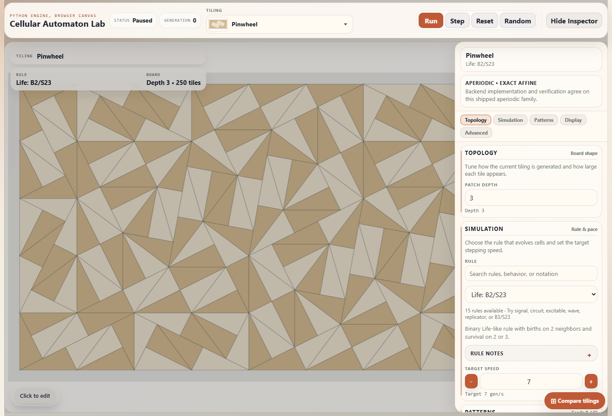
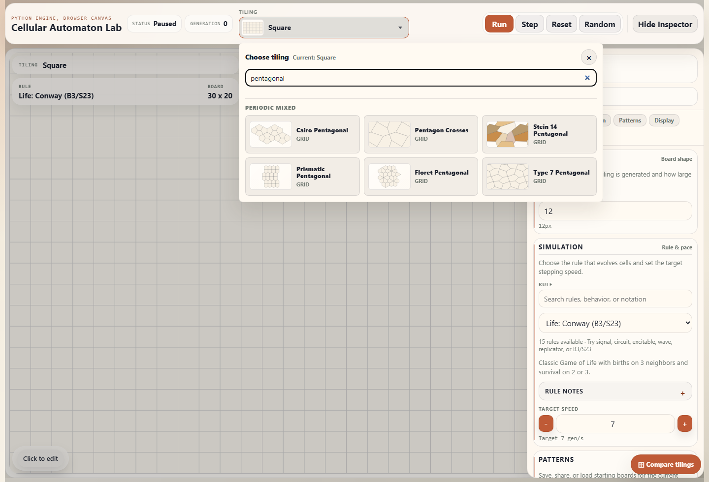

# Cellular Automaton Lab

[](https://github.com/Grgs/cellular-automaton-lab/actions/workflows/ci.yml)
[](https://github.com/Grgs/cellular-automaton-lab/actions/workflows/supply-chain-audit.yml)
[](https://github.com/Grgs/cellular-automaton-lab/releases/latest)
[](LICENSE)
[](https://grgs.github.io/cellular-automaton-lab/)

Cellular Automaton Lab is a browser-based cellular automata playground built around topology-first boards. It supports classic lattices, periodic mixed tilings, and finite aperiodic patches in one app, with a Flask backend and a Vite-built TypeScript frontend.

Public release status: `v0.5.0` preview. The preview is usable for public evaluation, local experimentation, and contribution, but it is not a long-term API or feature-stability promise.

Live standalone demo: [https://grgs.github.io/cellular-automaton-lab/](https://grgs.github.io/cellular-automaton-lab/)

**First time here?** [`docs/ONBOARDING.md`](docs/ONBOARDING.md) is a one-page decision tree -- find the row that matches what you want to do (run the app, add a tiling, use the topology library, etc.) and follow the link. The [`examples/`](examples/README.md) directory has short, runnable Python scripts for each major subsystem.


## Project Scope

This project explores cellular automata on rectangular and non-rectangular boards. The rule engine, editor, renderer, and pattern format are organized around topology data so the same app workflow can run on square grids, hex grids, mixed periodic tilings, and finite aperiodic patches.

It is intended for comparing how familiar automata behave on different local neighborhoods, testing topology and rendering ideas, and saving sparse patterns by stable cell IDs rather than lattice-specific grid coordinates.

## Highlights

- 55 shipped tiling families (3 regular grids, 28 periodic mixed tilings, 24 aperiodic patches including Penrose variants, the Hat/Turtle/Spectre monotiles, the chair/L-tetromino/P-pentomino rep-tiles, and 7-/9-/11-/12-/13-fold quasicrystals)
- 16 built-in rules spanning Life-like, mixed-tiling, excitable, and signal systems
- one shared `next_state(ctx)` rule protocol across all shipped topologies
- canvas-first editing with brush, line, rectangle, fill, undo/redo, presets, and pattern import/export
- compare workspace that runs one shared seed across many tilings, charts topology-sensitive outcomes, plays synchronized side-by-side filmstrips, saves named runs locally, and opens any result generation back into build mode (also scriptable via `python -m tools tilings compare`)
- sparse pattern persistence keyed by stable topology cell IDs
- TypeScript frontend in `frontend/` with Vitest unit tests and Playwright browser coverage

## Screenshots

### Snub Trihexagonal mixed-tiling board with the inspector open


### Pinwheel aperiodic patch with depth controls



### Tiling picker thumbnails for pentagonal families



## Suggested Demo Flows

- Start with Square + Conway, paint a few cells, use step/run, then export or copy the pattern to see the sparse `cells_by_id` format.
- Switch to Kagome or `4.8.8`, choose the matching mixed-tiling Life rule, and open the inspector while painting to see the same editor workflow on non-square neighborhoods.
- Switch to Penrose P3 Rhombs, Spectre, or Taylor-Socolar, adjust patch depth, and watch how a finite aperiodic patch remains editable and persistent.
- Compare the `Hat` and `Turtle` monotiles, two members of the same `Tile(a, b)` continuum, to see the same aperiodic adjacency realized with the two edge lengths exchanged.
- Switch to Penrose P1 and compare the `Distributed` and `Boat-Star` construction modes to see the difference between the distributed vertex-merge manifestation and the centered singular pentagrid patch.
- Try the convex pentagonal periodic catalog with Cairo, Prismatic, Floret, Type 7, Stein 14, and Pentagon Crosses to compare how the same rule family behaves on distinct pentagon adjacencies.
- Try Whirlpool or HexWhirlpool from the preset/showcase controls for a quick multi-state animation that exercises more than binary Life-like states.
- Open `#/compare` or use the floating compare button to compare one seed across tilings. Use **Run comparison** for the phase portrait/table, **Play side by side** for synchronized boards, and **Open gen N** on a live board to bring that generation back into build mode.
- Reload the standalone GitHub Pages demo after changing topology or state to check browser persistence without the Flask server.

## Compare Workspace

Compare mode is available from the floating **Compare tilings** button or directly at `#/compare`. It uses a shared seed, rule, traversal, frame count, and grid size so each selected tiling starts from comparable conditions. The tiling checklist and presets define the side-by-side panes; unsupported rule/tiling combinations are disabled in the picker and rejected by the backend if submitted directly.

The workspace has two run paths:

- **Run comparison** returns a phase portrait plus a result table. Each row can open or copy the begin/end board state as a normal `#share=v1...` board link.
- **Play side by side** builds a synchronized filmstrip. Play, pause, step, reset, scrub, and speed controls operate one shared clock across all boards. Each board has an **Open gen N** action that loads its current generation into build mode.

Use **Copy run link** to create a `#/compare&run=v1.<base64url-json>` URL. Opening that link restores the compare setup without auto-running or auto-playing, so cold loads do not start surprise work. Use **Saved runs** and **Saved tiling sets** to keep named compare setups in browser `localStorage`; they work in both the Flask app and the standalone demo, but they are local to the current browser/device. Run links are the portable format.

Current limits are intentional for interactive use: live filmstrips are bounded to a small selected set of tilings and a capped frame count by the backend, and compare mode is designed around one shared seed/rule configuration rather than independent per-pane rules.

## How It Works

- The simulation model is topology-first: rules evaluate cells through a neighbor context rather than direct grid indexing.
- The backend owns canonical simulation state; the browser renders snapshots and sends explicit mutations.
- Regular, mixed periodic, and aperiodic boards share the same rule protocol and editing workflow.
- Pattern files use sparse `cells_by_id` payloads instead of dense grid-only formats.
- The standalone build runs the Python simulation stack in a browser worker through Pyodide, so server and static-host demos share the same backend model.

For deeper orientation, start with:

- [Architecture](docs/ARCHITECTURE.md) for runtime boundaries and subsystem ownership
- [Code map](docs/CODE_MAP.md) for file-level navigation and call paths
- [Contributing](CONTRIBUTING.md) for setup, common commands, and contribution expectations
- [Maintenance](docs/MAINTENANCE.md) for guardrails, release process, and doc ownership

## Running Locally

1. Install Python dependencies:

```powershell
py -3 -m pip install -r requirements.txt
```

2. Install frontend dependencies:

```powershell
npm install
```

3. Build the frontend bundle:

```powershell
npm run build:frontend
```

4. Start the app:

```powershell
py -3 .\app.py
```

5. Open [http://127.0.0.1:5000](http://127.0.0.1:5000)

The server respects `HOST`, `PORT`, and `APP_INSTANCE_PATH`. If `static/dist/manifest.json` is missing, startup fails with a message telling you to run `npm run build:frontend`.

## Common Checks

The canonical "what to run" list lives in [`docs/ONBOARDING.md`](docs/ONBOARDING.md#run-tests). At a glance:

```powershell
npm run check:frontend     # frontend lint + build + vitest
npm run check:python       # ruff lint + ruff format check + mypy
npm run check:ci-local     # the broad local-CI sweep
```

For choosing narrower checks by change type, see [Testing changes](docs/TESTING_CHANGES.md). For the full strategy, browser diagnostics, and the release-confidence sweep, see [Testing strategy](docs/TESTING.md) and [Maintenance](docs/MAINTENANCE.md#public-release-process).

## Developer Guides

- [Adding rules](docs/ADDING_RULES.md)
- [Adding topologies](docs/ADDING_TOPOLOGIES.md)
- [Adding presets and patterns](docs/ADDING_PRESETS_AND_PATTERNS.md)
- [Choosing tests for changes](docs/TESTING_CHANGES.md)
- [Tools reference](docs/TOOLS.md)

## Release Surface

The public `v0.5.0` preview ships through three surfaces:

- tagged GitHub source releases
- the GitHub Pages standalone demo
- local source checkout for development and self-hosted use

This release does not publish an npm package or a PyPI package. The repository is the install and integration surface for now.

## Preview Status And Known Limitations

- `pinwheel` and `pinwheel-2-1` both ship in the main `Aperiodic` group: `pinwheel` was promoted on June 12, 2026 after correcting its subdivision shear, and `pinwheel-2-1` on June 13, 2026 after a visual review against the published Bielefeld patch (its exact-`Fraction` `1:4:sqrt(17)` tiles are congruence-verified at every depth).
- `dodecagonal-square-triangle` (catalog label "Schlottmann Square-Triangle") now runs the canonical Schlottmann quasi-periodic square-triangle substitution, verified tile-for-tile against the Tilings Encyclopedia's literature patch, and was promoted to the main `Aperiodic` group on July 2, 2026 — leaving no experimental aperiodic families.
- The standalone GitHub Pages demo targets static hosting with network access and still loads Pyodide from a CDN rather than bundling it for offline use.

The canonical list of known mathematical and rendering deviations lives in [docs/TILING_KNOWN_DEVIATIONS.md](docs/TILING_KNOWN_DEVIATIONS.md). Active follow-up work lives in [TODO.md](TODO.md).

## Intentional Non-Goals For This Preview

- No npm or PyPI package is published; the source repo and standalone demo are the release surface.
- No public plugin or extension API is promised yet.
- No separate JavaScript simulation engine is maintained for the standalone demo; the browser runtime reuses the Python backend through Pyodide.
- No full offline standalone bundle is shipped yet because Pyodide still loads from a CDN.
- No claim is made that every aperiodic family is a complete symbolic or literature-canonical construction; weaker or provisional cases are documented in the tiling deviation notes.

## Repository Layout

- `app.py`: local app entrypoint
- `backend/`: Flask app, simulation engine, rules, topology catalog, persistence, and API routes
- `frontend/`: authored TypeScript frontend source
- `static/css/`: authored styles
- `static/dist/`: generated frontend build output
- `templates/`: HTML shell
- `tests/`: backend, API, integration, and browser coverage
- `tools/`: validation, build, diagnosis, and profiling helpers
