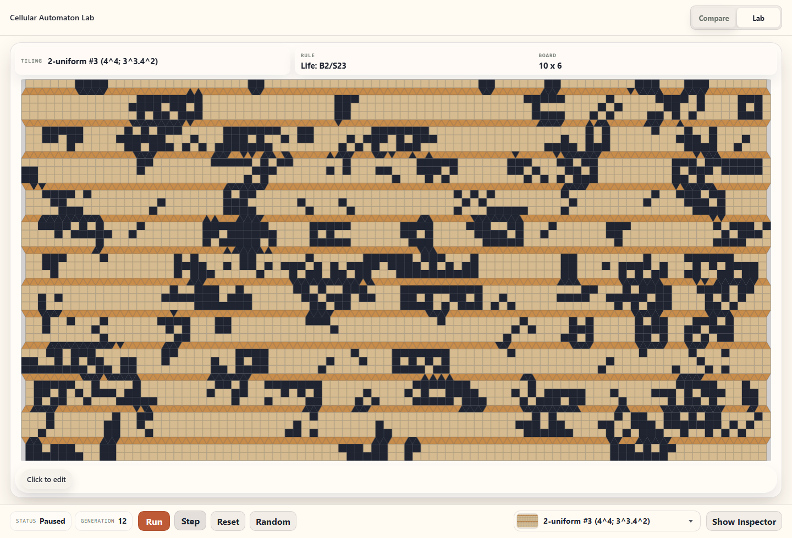

<p align="center">
  
</p>

<h1 align="center">Cellular Automaton Lab</h1>

<p align="center"><strong>Explore one cellular automaton across regular, periodic, and aperiodic tilings.</strong></p>

<p align="center">
  <a href="https://grgs.github.io/cellular-automaton-lab/"><strong>Try the live demo</strong></a>
  · <a href="docs/ONBOARDING.md">Get started</a>
  · <a href="docs/README.md">Documentation</a>
</p>

<p align="center">
  <a href="https://github.com/Grgs/cellular-automaton-lab/actions/workflows/ci.yml"></a>
  <a href="https://github.com/Grgs/cellular-automaton-lab/releases/latest"></a>
  <a href="LICENSE"></a>
</p>

Cellular Automaton Lab is a browser-based playground built around topology-first boards. The same editor, rule protocol, comparison tools, and sparse pattern format work across classic lattices, mixed periodic tilings, and finite aperiodic patches.


## One rule. Many neighborhoods.

| Compare | Explore | Extend |
|:--|:--|:--|
| Run one seed on several tilings in lockstep, then inspect how their populations diverge. | Move through 56 shipped tiling families, from square and hex grids to Penrose, Pinwheel, Hat, Turtle, and Spectre patches. | Add rules and topologies behind one shared `next_state(ctx)` protocol instead of building a new simulator for every lattice. |

### Highlights

- a comparison wall with synchronized playback, speaker view, live forks, editable seeds, saved runs, and portable run links
- 56 tiling families: 3 regular grids, 29 periodic mixed tilings, and 24 aperiodic patches
- 16 built-in Life-like, mixed-tiling, excitable, and signal rules
- canvas editing with brush, line, rectangle, fill, undo/redo, presets, and pattern import/export
- sparse pattern persistence keyed by stable topology cell IDs
- a standalone Pyodide build that runs the Python simulation stack directly in the browser

## Compare more than pictures

The wall can analyze the same starting pattern on every selected topology, producing a normalized population portrait and per-tiling end-state classification.


## Explore the Lab

<table>
  <tr>
    <td width="50%" valign="top">
      <a href="docs/images/readme-uniform-2-3-overview.png"></a>
      <br><sub><strong>Edit and evolve.</strong> The single-board Lab uses the same tools on regular and non-regular neighborhoods.</sub>
    </td>
    <td width="50%" valign="top">
      <a href="docs/images/readme-tiling-picker-thumbnails.png"></a>
      <br><sub><strong>Choose visually.</strong> Searchable thumbnails make a large topology catalog approachable.</sub>
    </td>
  </tr>
</table>

## Three good first runs

1. **Compare a wave.** Open the [live demo](https://grgs.github.io/cellular-automaton-lab/), press **Play**, and watch the featured R-pentomino bend around four different neighborhoods.
2. **Edit a mixed tiling.** Open **Lab**, choose Kagome or `4.8.8`, load its matching Life rule, and paint while the inspector shows the local topology.
3. **Explore an aperiodic patch.** Choose Penrose P3, Pinwheel, Spectre, or Taylor-Socolar and change the patch depth before stepping the simulation.

For speaker view, live forks, shared-seed editing, analysis, saved runs, and routing, see the [comparison wall guide](docs/COMPARISON_WALL.md).

## How it works

- Rules evaluate cells through a neighbor context rather than direct grid indexing.
- The backend owns canonical simulation state; the browser renders snapshots and sends explicit mutations.
- Regular, mixed periodic, and aperiodic boards share the same rule protocol and editing workflow.
- Pattern files store sparse `cells_by_id` payloads instead of dense grid-only formats.
- The static demo runs the same Python simulation model in a browser worker through Pyodide.

Read [Architecture](docs/ARCHITECTURE.md) for runtime boundaries or the [Code map](docs/CODE_MAP.md) for file-level navigation.

## Quick start

You need Python 3.13+ and Node 22+. From the repository root:

```console
python -m pip install -r requirements.txt
npm install
npm run build:frontend
python app.py
```

Then open [http://127.0.0.1:5000](http://127.0.0.1:5000). For virtual-environment setup, active frontend development, and test commands, follow [Onboarding](docs/ONBOARDING.md).

## Documentation

| Goal | Start here |
|:--|:--|
| Use the comparison wall | [Comparison wall guide](docs/COMPARISON_WALL.md) |
| Find the right setup or test command | [Onboarding](docs/ONBOARDING.md) · [Testing changes](docs/TESTING_CHANGES.md) |
| Understand the system | [Architecture](docs/ARCHITECTURE.md) · [Code map](docs/CODE_MAP.md) |
| Add a rule, topology, or preset | [Adding rules](docs/ADDING_RULES.md) · [Adding topologies](docs/ADDING_TOPOLOGIES.md) · [Adding presets](docs/ADDING_PRESETS_AND_PATTERNS.md) |
| Use the Python subsystems directly | [Runnable examples](examples/README.md) |
| Contribute | [Contributing guide](CONTRIBUTING.md) |

## Preview status

The current public release is the `v0.5.0` preview. It is ready for evaluation, local experimentation, and contribution, but it does not promise long-term API or feature stability yet.

- Releases ship as tagged source, the GitHub Pages standalone demo, and local source checkout; there is no npm or PyPI package yet.
- The standalone demo needs network access because it loads Pyodide from a CDN.
- Mathematical and rendering qualifications are tracked in [Tiling known deviations](docs/TILING_KNOWN_DEVIATIONS.md); active follow-up work lives in [TODO.md](TODO.md).

Cellular Automaton Lab is available under the [MIT License](LICENSE).
