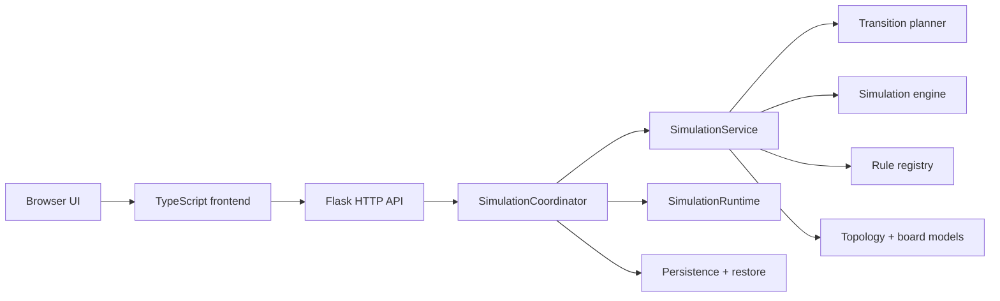

# Architecture

`cellular-automaton-lab` is a topology-first cellular automaton application with a Flask backend and a Vite-built TypeScript frontend.

The backend owns canonical simulation state. The frontend renders that state, edits cells, and sends explicit mutations back to the backend. The browser does not run rule evolution locally.

## System Overview

## Runtime Boundaries

- [app.py](../app.py) starts the Flask app by calling [backend/api.py](../backend/api.py).
- [backend/frontend_assets.py](../backend/frontend_assets.py) loads `static/dist/manifest.json` and resolves the frontend entry assets.
- [templates/index.html](../templates/index.html) renders the HTML shell, injects backend bootstrapped data, and loads the manifest-resolved frontend bundle.
- [frontend/app.ts](../frontend/app.ts) is the browser entrypoint.

Important runtime rules:

- `frontend/` is the only authored frontend source tree.
- `static/dist/` is generated Vite output and is not committed.
- The backend is authoritative for topology, rule, speed, generation, and cell state.
- Frontend edits and control changes go through HTTP mutations and return refreshed snapshots.

## Backend

### HTTP Layer

[backend/web/routes.py](../backend/web/routes.py) is intentionally thin. It parses requests, delegates to the coordinator, and returns serialized snapshots, topology payloads, or metadata.

Core endpoints:

- `GET /`
- `GET /api/state`
- `GET /api/topology`
- `GET /api/rules`
- `GET /api/meta`
- `POST /api/control/start`
- `POST /api/control/pause`
- `POST /api/control/resume`
- `POST /api/control/step`
- `POST /api/control/reset`
- `POST /api/config`
- `POST /api/cells/toggle`
- `POST /api/cells/set`
- `POST /api/cells/set-many`

### Coordinator and Services

[backend/simulation/coordinator.py](../backend/simulation/coordinator.py) is the backend facade used by the routes layer. It coordinates:

- [backend/simulation/service.py](../backend/simulation/service.py) for synchronous state mutations
- [backend/simulation/runtime.py](../backend/simulation/runtime.py) for background stepping
- [backend/simulation/persistence_coordinator.py](../backend/simulation/persistence_coordinator.py) for persistence timing
- [backend/simulation/state_restore.py](../backend/simulation/state_restore.py) for restore behavior

[backend/simulation/transition_planner.py](../backend/simulation/transition_planner.py) contains the pure planning logic for reset, config, and restore transitions.

### Simulation Model

The simulation model is topology-first:

- topology defines stable cell identifiers and neighborhood relationships
- the board stores ordered `cell_states` aligned with that topology
- rule, speed, generation, and running state are metadata on the current snapshot

Core model types live in [backend/simulation/topology.py](../backend/simulation/topology.py).

Pattern files and durable payloads use sparse `cells_by_id` maps keyed by stable topology cell IDs.

### Topology Catalog

[backend/simulation/topology_catalog.py](../backend/simulation/topology_catalog.py) is the canonical topology catalog. It defines:

- tiling families and adjacency modes
- sizing mode and sizing policy
- labels and picker grouping
- default rule and capability flags
- viewport and frontend-facing metadata

The backend serializes this catalog into `window.APP_TOPOLOGIES`, and the frontend uses it as its primary topology source of truth.

### Rules

Rules are modules under [backend/rules](../backend/rules). Each rule provides:

- metadata
- state definitions
- default paint state
- optional randomization weights
- `next_state(ctx)` behavior

All shipped rules use the same `universal-v1` rule protocol.

## Frontend

### Composition

The frontend is composed around a single controller stack:

- [frontend/app.ts](../frontend/app.ts)
- [frontend/main.ts](../frontend/main.ts)
- [frontend/app-controller.ts](../frontend/app-controller.ts)
- [frontend/app-controller-startup.ts](../frontend/app-controller-startup.ts)
- [frontend/app-controller-sync.ts](../frontend/app-controller-sync.ts)
- [frontend/app-controller-bootstrap.ts](../frontend/app-controller-bootstrap.ts)

This stack creates DOM bindings, application state, the canvas view, actions, interaction handlers, session persistence, and viewport/config synchronization.

### State and Reconciliation

State is split under [frontend/state](../frontend/state):

- [simulation-state.ts](../frontend/state/simulation-state.ts)
- [sizing-state.ts](../frontend/state/sizing-state.ts)
- [overlay-state.ts](../frontend/state/overlay-state.ts)
- [snapshot-reducer.ts](../frontend/state/snapshot-reducer.ts)
- [selectors.ts](../frontend/state/selectors.ts)
- [polling.ts](../frontend/state/polling.ts)

[frontend/simulation-reconciler.ts](../frontend/simulation-reconciler.ts) applies backend snapshots, handles topology changes, resets transient UI state when needed, and coordinates polling/render updates.

### Actions and Mutations

User workflows live in:

- [frontend/app-actions.ts](../frontend/app-actions.ts)
- [frontend/actions/simulation/](../frontend/actions/simulation/)
- [frontend/actions/pattern-actions.ts](../frontend/actions/pattern-actions.ts)
- [frontend/actions/preset-actions.ts](../frontend/actions/preset-actions.ts)
- [frontend/actions/showcase-actions.ts](../frontend/actions/showcase-actions.ts)
- [frontend/actions/ui-actions.ts](../frontend/actions/ui-actions.ts)

These modules perform optimistic UI updates, serialize mutations, send HTTP requests, and reconcile the returned backend state.

### Controls and View Shell

The control shell is split into distinct model, view, and binding layers:

- [frontend/controls-model.ts](../frontend/controls-model.ts)
- [frontend/controls-model/](../frontend/controls-model/)
- [frontend/controls-view.ts](../frontend/controls-view.ts)
- [frontend/controls-bindings.ts](../frontend/controls-bindings.ts)
- [frontend/controls-shortcuts.ts](../frontend/controls-shortcuts.ts)
- [frontend/app-view.ts](../frontend/app-view.ts)
- [frontend/blocking-activity.ts](../frontend/blocking-activity.ts)

`controls-model` builds typed UI view-models from state. `controls-view` renders them. The bindings layer wires UI events back into the action/controller stack.

### Editor and Interaction Stack

Canvas editing lives in:

- [frontend/interactions.ts](../frontend/interactions.ts)
- [frontend/interactions/](../frontend/interactions/)
- [frontend/editor-tools.ts](../frontend/editor-tools.ts)
- [frontend/editor-operations.ts](../frontend/editor-operations.ts)
- [frontend/editor-history.ts](../frontend/editor-history.ts)
- [frontend/drag-session.ts](../frontend/drag-session.ts)
- [frontend/cell-resolution.ts](../frontend/cell-resolution.ts)
- [frontend/mutation-runner.ts](../frontend/mutation-runner.ts)

The editor supports brush, line, rectangle, fill, and diff-based undo/redo.

### Rendering and Geometry

Canvas rendering is built around geometry adapters:

- [frontend/canvas-view.ts](../frontend/canvas-view.ts)
- [frontend/canvas/](../frontend/canvas/)
- [frontend/geometry/](../frontend/geometry/)
- [frontend/geometry-adapters.ts](../frontend/geometry-adapters.ts)
- [frontend/geometry-core.ts](../frontend/geometry-core.ts)
- [frontend/layout.ts](../frontend/layout.ts)
- [frontend/topology.ts](../frontend/topology.ts)

The adapter layer is responsible for:

- render metrics
- geometry caches
- hit testing
- viewport previews
- cell centers and polygon geometry

Regular, mixed periodic, and aperiodic tilings all render through this shared topology-aware canvas pipeline.

### Presets, Patterns, and Session Persistence

Preset and pattern logic lives in:

- [frontend/presets.ts](../frontend/presets.ts)
- [frontend/presets/](../frontend/presets/)
- [frontend/preset-selection.ts](../frontend/preset-selection.ts)
- [frontend/pattern-io.ts](../frontend/pattern-io.ts)
- [frontend/ui-session.ts](../frontend/ui-session.ts)
- [frontend/ui-session-controller.ts](../frontend/ui-session-controller.ts)

Pattern files are sparse topology-first snapshots. Browser UI session state is stored separately from persisted simulation state.

## State Flow

The main runtime loop is:

1. Flask renders the page and bootstraps defaults, topology descriptors, and other small static payloads into the page.
2. The frontend creates the controller/view stack and requests the current simulation snapshot.
3. User actions send explicit mutation requests to the backend.
4. The backend applies the mutation and returns the new canonical snapshot.
5. The frontend reconciles that snapshot into local state and re-renders controls and canvas.

This keeps rule evaluation and topology transitions centralized in the backend while preserving a responsive editor in the browser.

## Build and Test

### Build

- `npm run build:frontend` builds the Vite app into `static/dist/`
- the Flask app requires `static/dist/manifest.json` at startup
- `npm run dev:frontend` keeps the frontend bundle up to date during local development

### Test Layers

- frontend unit and module tests run in Vitest against `frontend/`
- backend, API, and integration tests run under Python `unittest`
- browser end-to-end coverage runs in Playwright, with chunked subsets in CI

### CI Invariants

CI enforces:

- frontend typecheck passes
- frontend contains no `@ts-nocheck`
- frontend contains no `as unknown as`
- frontend builds successfully
- frontend Vitest suites pass
- backend mypy, tiling validation, and Python tests pass
- Playwright suite integrity and chunked browser subsets pass
