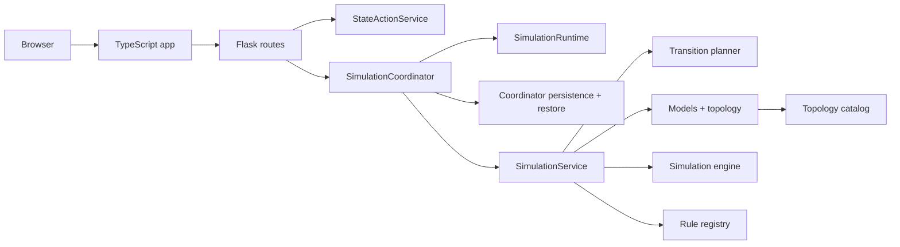

# Architecture

`cellular-automaton-lab` is a topology-first cellular automaton app with a Flask backend and a Vite-built TypeScript frontend.

The backend owns canonical simulation state, rule evaluation, topology transitions, persistence, and background stepping. The frontend renders that state, lets the user edit cells and controls, and sends explicit HTTP mutations back to the backend. The browser does not evolve the automaton locally.

## System Overview

## Runtime Boundaries

- [app.py](../app.py) starts the Flask app by calling [backend/api.py](../backend/api.py).
- [backend/frontend_assets.py](../backend/frontend_assets.py) resolves Vite output from `static/dist/manifest.json`.
- [templates/index.html](../templates/index.html) is the thin server wrapper that injects bootstrapped defaults, topology metadata, periodic-face descriptors, server asset links, and the rendered shell markup.
- [frontend/shell/app-shell-body.html](../frontend/shell/app-shell-body.html) is the shared shell source consumed by both Flask and the standalone build.
- [backend/app_shell.py](../backend/app_shell.py) renders the shared shell for the server host and generates the standalone shell document that the standalone build stages into its transient input directory.
- [frontend/server-entry.ts](../frontend/server-entry.ts) is the canonical server host entrypoint.
- [frontend/app-runtime.ts](../frontend/app-runtime.ts) owns the shared `initApp(...)` / `disposeApp()` lifecycle API.
- [frontend/types/controller-*.d.ts](../frontend/types) split the controller/runtime contracts by concern and re-export them through [frontend/types/controller.d.ts](../frontend/types/controller.d.ts).

Important rules:

- `frontend/` is the only authored frontend source tree.
- `static/dist/` is generated build output.
- Backend snapshots are authoritative for topology, rule, speed, running state, generation, and cell states.
- Frontend edits and control changes are explicit mutations that return the next canonical snapshot.

## Backend

### HTTP Layer

[backend/web/routes.py](../backend/web/routes.py) is intentionally thin. It owns:

- Flask route wiring
- extension lookup
- response helpers
- request validation handoff

Typed mutation application lives in [backend/web/state_actions.py](../backend/web/state_actions.py), not in the route handlers themselves.

Main API endpoints:

- `GET /`
- `GET /api/state`
- `GET /api/topology`
- `GET /api/rules`
- `GET /api/meta`
- `POST /api/control/start`
- `POST /api/control/pause`
- `POST /api/control/resume`
- `POST /api/control/step`
- `POST /api/control/reset`
- `POST /api/config`
- `POST /api/cells/toggle`
- `POST /api/cells/set`
- `POST /api/cells/set-many`

### Coordinator And Runtime

[backend/simulation/coordinator.py](../backend/simulation/coordinator.py) is the public backend façade used by startup and the HTTP layer. It now delegates responsibility instead of owning every subsystem directly:

- [backend/simulation/runtime.py](../backend/simulation/runtime.py) runs background stepping.
- [backend/simulation/coordinator_persistence.py](../backend/simulation/coordinator_persistence.py) owns persistence scheduling and state-store save/load behavior.
- [backend/simulation/coordinator_restore.py](../backend/simulation/coordinator_restore.py) owns persisted-state restore flow.
- [backend/simulation/coordinator_mutations.py](../backend/simulation/coordinator_mutations.py) owns immediate vs deferred mutation dispatch.

[backend/simulation/bootstrap.py](../backend/simulation/bootstrap.py) wires the rule registry, coordinator, and persistent state store into Flask extensions.

### Simulation Service

[backend/simulation/service.py](../backend/simulation/service.py) is the synchronous simulation façade. It delegates board mutation and transition work into focused helpers:

- [backend/simulation/service_transitions.py](../backend/simulation/service_transitions.py)
- [backend/simulation/service_cells.py](../backend/simulation/service_cells.py)
- [backend/simulation/service_boards.py](../backend/simulation/service_boards.py)
- [backend/simulation/service_snapshots.py](../backend/simulation/service_snapshots.py)

[backend/simulation/transition_planner.py](../backend/simulation/transition_planner.py) contains the pure planning logic for reset, config, and restore transitions.

### Models, Topology, And Persistence

Core simulation and topology types live in:

- [backend/simulation/models.py](../backend/simulation/models.py)
- [backend/simulation/topology.py](../backend/simulation/topology.py)
- [backend/simulation/persistence.py](../backend/simulation/persistence.py)
- [backend/simulation/state_restore.py](../backend/simulation/state_restore.py)

Important model rules:

- topology defines stable cell identifiers and neighborhood relationships
- boards store cell state aligned with that topology
- persisted snapshots use sparse `cells_by_id` maps keyed by stable cell IDs
- restore always normalizes external payloads back into backend-owned model objects

### Topology Catalog

[backend/simulation/topology_catalog.py](../backend/simulation/topology_catalog.py) is now a public façade, not the home of all catalog data.

Its internal split is:

- [backend/simulation/topology_catalog_data.py](../backend/simulation/topology_catalog_data.py) for static topology variant and sizing-policy definitions
- [backend/simulation/topology_catalog_types.py](../backend/simulation/topology_catalog_types.py) for catalog definition dataclasses
- [backend/simulation/topology_catalog_build.py](../backend/simulation/topology_catalog_build.py) for catalog construction
- [backend/simulation/topology_catalog_queries.py](../backend/simulation/topology_catalog_queries.py) for serialization helpers

The catalog remains the canonical source of:

- tiling-family and adjacency-mode metadata
- sizing policy and patch-depth behavior
- picker grouping and ordering
- default rule selection
- frontend bootstrapped topology metadata

### Rules

Rules live under [backend/rules](../backend/rules). Each rule provides:

- metadata
- state definitions
- default paint state
- optional randomization weights
- `next_state(ctx)` behavior

All shipped rules share the same rule protocol and are exposed through [backend/rules/__init__.py](../backend/rules/__init__.py) and the registry.

## Frontend

### Controller Stack

The frontend is built around a controller and view composition stack:

- [frontend/server-entry.ts](../frontend/server-entry.ts)
- [frontend/app-runtime.ts](../frontend/app-runtime.ts)
- [frontend/app-controller.ts](../frontend/app-controller.ts)
- [frontend/app-controller-startup.ts](../frontend/app-controller-startup.ts)
- [frontend/app-controller-services.ts](../frontend/app-controller-services.ts)
- [frontend/app-controller-wiring.ts](../frontend/app-controller-wiring.ts)
- [frontend/app-controller-hydration.ts](../frontend/app-controller-hydration.ts)
- [frontend/app-controller-sync.ts](../frontend/app-controller-sync.ts)
- [frontend/app-controller-bootstrap.ts](../frontend/app-controller-bootstrap.ts)

This stack now makes the startup order explicit: service construction, interaction/view wiring, then async hydration and binding. It creates application state, canvas/grid rendering, control actions, session persistence, config sync, and interaction handlers.

### State And Reconciliation

State is split under [frontend/state](../frontend/state):

- simulation and topology state
- sizing and patch-depth state
- overlay and drawer state
- selectors and polling
- snapshot reconciliation

[frontend/simulation-reconciler.ts](../frontend/simulation-reconciler.ts) is the bridge between backend snapshots and frontend state. It applies canonical snapshots, resets transient UI state when needed, and triggers render/polling updates.

### Config Sync

[frontend/config-sync-controller.ts](../frontend/config-sync-controller.ts) is now a thin façade over [frontend/config-sync](../frontend/config-sync):

- state and view-state tracking
- shared config mutation execution
- speed debounce scheduling
- rule sync execution

This layer owns pending and syncing UI state for rule and speed controls and keeps backend-backed config changes serialized.

### Actions

- [frontend/app-actions.ts](../frontend/app-actions.ts) is the top-level action composer.
- [frontend/app-action-groups.ts](../frontend/app-action-groups.ts) splits that composition into simulation/config, pattern/preset/showcase, and editor/UI groups.

Those layers combine:

- [frontend/actions/simulation](../frontend/actions/simulation)
- [frontend/actions/preset-actions.ts](../frontend/actions/preset-actions.ts)
- [frontend/actions/pattern-actions.ts](../frontend/actions/pattern-actions.ts)
- [frontend/actions/showcase-actions.ts](../frontend/actions/showcase-actions.ts)
- [frontend/actions/ui-actions.ts](../frontend/actions/ui-actions.ts)

The simulation action runtime is split further into rule and speed sync, topology selection, patch-depth runtime, and follow-up effects. Reset-all-settings policy lives in [frontend/actions/default-reset.ts](../frontend/actions/default-reset.ts).

### Controls Shell

The control shell is explicitly layered:

- [frontend/controls-model](../frontend/controls-model) builds typed view-models from app state
- [frontend/controls-view.ts](../frontend/controls-view.ts) and [frontend/controls](../frontend/controls) render the control panel in feature sections
- [frontend/controls-bindings.ts](../frontend/controls-bindings.ts) is a thin binding entrypoint over feature-specific binding modules

The binding split is:

- simulation controls
- editor and pattern controls
- chrome and shell click behavior
- disclosure and shortcut wiring

### Interaction And Editor Stack

Canvas editing and pointer behavior are split across:

- [frontend/interactions.ts](../frontend/interactions.ts)
- [frontend/interaction-groups.ts](../frontend/interaction-groups.ts)
- [frontend/interactions](../frontend/interactions)
- [frontend/editor-operations.ts](../frontend/editor-operations.ts)
- [frontend/editor-history.ts](../frontend/editor-history.ts)
- [frontend/mutation-runner.ts](../frontend/mutation-runner.ts)

Important interaction seams:

- pointer and drag lifecycle
- edit policy and overlay dismissal
- command dispatch and serialized mutations
- editor preview generation
- diff-based undo and redo

### Rendering And Geometry

Rendering is centered on:

- [frontend/canvas-view.ts](../frontend/canvas-view.ts)
- [frontend/canvas](../frontend/canvas)
- [frontend/geometry](../frontend/geometry)
- [frontend/geometry-adapters.ts](../frontend/geometry-adapters.ts)
- [frontend/topology-catalog.ts](../frontend/topology-catalog.ts)

The render pipeline handles:

- canvas surface sizing and DPR management
- committed render layers
- preview overlays
- hit testing and cell resolution
- geometry caches and adapter-specific metrics

Regular, mixed periodic, and aperiodic tilings all render through the same topology-aware canvas pipeline.

### Presets, Patterns, And Session Storage

Preset, pattern, and browser-session behavior lives in:

- [frontend/presets.ts](../frontend/presets.ts)
- [frontend/presets](../frontend/presets)
- [frontend/pattern-io.ts](../frontend/pattern-io.ts)
- [frontend/ui-session.ts](../frontend/ui-session.ts)
- [frontend/ui-session-controller.ts](../frontend/ui-session-controller.ts)
- [frontend/parsers](../frontend/parsers)

Important persistence rule:

- simulation state persistence is backend-owned
- browser UI preferences are versioned frontend session storage

## State Flow

The main runtime loop is:

1. Flask renders the server wrapper and injects bootstrapped defaults, topology catalog entries, periodic-face descriptors, and the shared shell markup.
2. The frontend builds controller, view, config-sync, session, and interaction layers.
3. The frontend fetches the current backend snapshot.
4. User actions send explicit control or cell-mutation requests.
5. The backend applies the mutation and returns the next canonical snapshot.
6. The frontend reconciles that snapshot into state and re-renders controls and canvas.

This keeps topology transitions, rule evaluation, and persistence centralized in the backend while preserving a responsive editor and control panel in the browser.

## Build And Test

### Build

- `npm run build:frontend` builds the Vite app into `static/dist/`
- Flask startup requires `static/dist/manifest.json`
- `npm run dev:frontend` keeps the frontend bundle updated during local development

### Tests

- frontend unit and module tests run in Vitest against `frontend/`
- backend, API, and integration tests run in Python `unittest`
- browser end-to-end coverage runs through Playwright-based Python tests

### CI Invariants

CI enforces:

- frontend typecheck passes
- frontend contains no `@ts-nocheck`
- frontend contains no `as unknown as`
- frontend builds and Vitest suites pass
- Python mypy, tiling validation, and unit/API tests pass
- Playwright suite integrity and browser subsets pass
