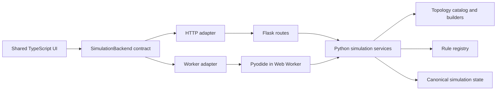

# Design: One Engine, Many Neighborhoods, Two Hosts

Status: current design narrative for the development branch. Last audited
against the implementation on August 2, 2026.

This document explains how the product problem leads to the current design. It
is a reasoning journey, not a claim about the chronological history of the
repository. For current subsystem structure, read
[ARCHITECTURE.md](ARCHITECTURE.md). For file and call-path navigation, read
[CODE_MAP.md](CODE_MAP.md).

## The Grid Is The First Limitation

A conventional cellular automaton often lets its storage representation define
its world. A cell is an array position; its neighbors are calculated from row
and column offsets; the rule is written with that grid in mind. This is simple
and efficient, but it makes the square grid part of the meaning of the
simulation.

Cellular Automaton Lab starts from a different product question: what happens
when the same rule or seed is placed on regular, periodic mixed, and aperiodic
neighborhoods?

That question rules out an engine built around one privileged array shape. In
this application, a topology defines the cells and their neighbor
relationships. Simulation state assigns values to those cells, and a rule
evaluates a cell through a shared `RuleContext`. Stable cell IDs and adjacency
are therefore model contracts, not rendering details.

This topology-first model gives the application its defining capability:
topology construction can vary without rewriting the simulation loop. It also
creates new obligations. Mixed tilings may attach meaning to cell kinds, and
aperiodic families may need specialized construction and verification. A rule
that depends on those properties must declare its compatibility rather than
quietly assuming a square neighborhood.

## One Meaning Of A Simulation

Making topology explicit solves the grid problem, but raises a more important
one. The topology builders are now part of the meaning of the simulation. Some
encode mathematical constructions; rules, transitions, snapshot validation,
and comparison calculations all depend on them.

If the server and browser had separate implementations of that behavior, a
named rule or tiling could gradually mean different things in each environment.
Every feature would become a parity exercise, and correctness fixes would have
to land twice.

The design therefore keeps simulation semantics in Python. Python owns topology
construction, rule evaluation, transitions, snapshot validation, and comparison
calculations. The repository can also use this core without Flask or a browser
when a test, script, or caller needs only topology, rules, or simulation
services.

This is the first major bargain in the design: one correctness-sensitive engine
is worth more than the smallest possible browser bundle. That bargain becomes
challenging as soon as the application needs more than one way to run.

## The Need To Run In Two Places

A local Python application has a natural delivery model. Flask can expose the
Python services over HTTP, serve the built frontend, and coordinate durable
server-owned sessions. Kept thin, it is a useful adapter without becoming the
domain model. Route wiring, request extraction, response wrappers, and server
startup belong to Flask; simulation behavior does not.

But a public laboratory should also be easy to publish and explore. Requiring
every visitor to install Python or depend on a continuously operated application
server would make the experiment harder to share. A static artifact suitable
for GitHub Pages offers a second, valuable delivery mode.

Static hosting appears to conflict with a Python-owned engine. There are three
obvious responses:

1. rewrite the simulation in TypeScript
2. attempt to run the Flask application in the browser
3. run the framework-neutral Python core in the browser

The first creates two simulation engines. The second carries server-side HTTP
and WSGI concepts into an environment where they add no value. The design takes
the third path: the standalone build packages the Python sources and a pinned
Pyodide runtime, then runs them inside a Web Worker.

The worker is important. Python startup and simulation work do not take over the
UI thread, and worker messages create an explicit boundary around runtime state.
The result is a static application with no separately running Python backend
process, although Python still executes locally in the user's browser.

The standalone artifact includes its Python sources, Python standard library
archive, Pyodide runtime, bootstrap metadata, and frontend assets. It has no CDN
runtime dependency. Like most worker- and module-based applications, it must be
served from an HTTP origin rather than opened with `file://`; a basic local
static server is sufficient.

At this point the system has one engine, but two hosts:

| Concern | Server host | Standalone host |
|---|---|---|
| Python execution | CPython process | Pyodide in a Web Worker |
| Transport | Flask HTTP routes | Worker messages using API-shaped paths |
| Simulation authority | Session coordinator | Worker-local runtime |
| Run loop | Backend coordinator thread | Worker timers |
| Simulation persistence | Backend session store | IndexedDB, with `localStorage` fallback |
| Deployment | Python process plus built assets | Static HTTP hosting |

Flask enables the server-hosted application. Pyodide enables the standalone
application. Neither is the application core.

## Preventing Two Hosts From Becoming Two Products

Solving execution creates the next problem. Two transports and two lifecycle
models can easily grow into two user interfaces, two payload conventions, and
two sets of defaults.

The frontend therefore depends on a `SimulationBackend` contract rather than on
`fetch`, Flask, or Pyodide directly. The HTTP adapter speaks to Flask. The worker
adapter sends API-shaped commands to the browser runtime. Host selection happens
when the frontend environment is created; the controller stack follows the same
path afterward.

Below those adapters, shared operations have semantic command identities such
as `simulation.reset` and `cells.set_many`. Flask routes and worker messages map
their transport paths to the same command registry, request normalization,
domain dispatcher, result kinds, and public-error model. Flask still owns HTTP
status codes and session lookup; the standalone host still owns worker
envelopes, initialization, timers, and browser persistence. Sharing command
meaning does not require pretending the hosts have the same lifecycle.

The frontend environment makes the remaining host differences explicit. It
advertises discriminated capabilities for live forks and persistence rather
than asking features to infer behavior from a host name or nullable collection
of services. A supported capability carries the service needed to use it; an
unsupported capability carries an explicit fallback and explanation.

Authored sources follow the same rule. `frontend/` is the only authored
frontend tree. Server and standalone wrappers consume the same shell body.
Canonical defaults and topology metadata come from backend-owned sources, with
Flask injecting server bootstrap data and the standalone build emitting JSON.
`static/dist/` and `output/standalone/` are generated products, not alternative
places to edit the application.

This boundary is intentionally constraining. A new shared operation must enter
the semantic registry, both transport mappings, and the Python/TypeScript
payload contracts together. Contract tests compare payload fields and command
IDs, standalone runtime decoders reject malformed worker data, and parity tests
exercise valid and invalid commands through Flask and Pyodide targets. Host-
specific behavior still needs focused tests. In exchange, the two delivery
modes remain one product rather than similar-looking forks.

The architecture that follows from the journey is:

The important boundary is not “Python versus browser.” It is the host adapter
around shared simulation behavior.

## Deciding Who Owns The Truth

A shared interface does not by itself answer who owns state. If the frontend
evolves cells optimistically while Python also evolves them, there are two
simulation authorities. If every small edit transfers a complete board, the
authority is clear but the protocol is wasteful.

The active Python runtime is therefore authoritative for simulation state. The
frontend caches snapshots for rendering and applies only validated, revisioned
deltas. Control mutations return canonical snapshots. Cell mutations may return
deltas carrying `base_state_revision`, `state_revision`, and `state_epoch`. A
revision mismatch triggers a full-state resynchronization instead of a guessed
merge. Revisions are runtime-local and intentionally not persisted.

Persistence follows ownership rather than being made artificially identical:

- the server host persists simulation snapshots through its backend session
  store
- the standalone host persists simulation snapshots in browser storage
- the browser owns interface preferences, saved comparison runs, and saved
  tiling sets in both modes
- portable run links are the cross-device sharing format

The two hosts consequently offer different guarantees. Server sessions can
survive process restarts through backend persistence. Standalone state survives
reload on one browser and device. Static hosting does not imply server session
isolation, cloud synchronization, or an account system.

## Expanding The Meaning Of Correct

Unusual topology introduces one final design pressure: “the program did not
crash” is a very weak definition of correctness.

A topology can have internally consistent polygons and adjacency while still
representing the wrong published construction. A mathematically sound finite
patch can still render badly, expose misleading metadata, or behave poorly in
the picker. The project therefore treats three claims separately:

1. **Geometric validity:** emitted geometry, IDs, and adjacency are internally
   sane.
2. **Literature faithfulness:** the construction satisfies falsifiable,
   source-backed expectations for its family.
3. **Visible quality:** the topology renders and interacts acceptably in the
   actual application.

The testing strategy mirrors those claims. Pure logic belongs in unit tests;
payload boundaries in API and contract tests; topology claims in validators and
reference checks; real DOM, canvas, storage, and host behavior in Playwright.
Server and standalone modes share user-flow coverage where their behavior
should match, while host-specific guarantees receive focused coverage.

This layered approach is not merely an optimization for test speed. It keeps a
green browser journey from being mistaken for mathematical evidence, and keeps
implementation-generated fixtures from being the only judge of the
implementation that generated them.

## The Current Bargain

The current design makes a deliberate set of trades:

- It accepts Pyodide artifact size and cold-start latency to keep one Python
  simulation engine.
- It accepts two host adapters to make both a durable local server and a static
  public application possible.
- It accepts explicit IDs, sparse state, and specialized builders rather than
  forcing mixed and aperiodic neighborhoods into dense rectangular arrays.
- It accepts host-specific persistence guarantees instead of pretending local
  browser storage is a server database.
- It accepts that topology families have different proof strengths. Exact
  substitutions, exact-affine constructions, canonical finite patches, and
  documented deviations must not be presented as equivalent claims.
- During the preview release line, it accepts repository source and generated
  artifacts as the integration surface rather than promising a stable Python,
  npm, or plugin API.

These are costs of the product the project has chosen to build, not incidental
implementation details. They should be reconsidered if the product problem
changes.

## Open Design Questions

The command, capability, and payload-contract directions described by earlier
versions of this document are now part of the current architecture above. The
following questions remain pressures to measure or decisions to make, not
compatibility promises:

- At what point would Pyodide startup or artifact size outweigh the value of a
  single simulation implementation?
- Which persistence guarantees, if any, should become portable across hosts and
  devices?
- Would a third host validate the adapter boundary, or reveal that the contract
  is too closely shaped around HTTP?
- Can more topology verification be derived from independent source data
  without mistaking generated fixtures for independent evidence?

An open question is deliberately not a promise. It records a pressure future
maintainers are likely to encounter and the assumptions that should be tested
before changing the design.

## Boundaries And Non-Goals

The current design does not attempt to provide:

- a stable public Python, npm, or plugin API during the preview release line
- multi-user server collaboration
- cloud-synchronized browser preferences or an account-backed state store
- arbitrary untrusted Python execution in the browser
- one generic construction or proof technique for every aperiodic family
- a standalone directory that works when opened directly with `file://`

These are boundaries, not declarations that the features can never exist. Each
would introduce a new product problem and should earn its own design journey.

## Decision Index

This index is the short reference view of the design. The narrative above is
the rationale.

| # | Durable decision | Practical implication |
|---|---|---|
| 1 | Topology is a first-class model. | Boards use stable cells and explicit adjacency; rules query `RuleContext`. |
| 2 | Python owns simulation semantics in both hosts. | Topology, rules, transitions, validation, and comparisons have one implementation. |
| 3 | Flask is a thin server adapter. | HTTP concerns stay at the edge; domain behavior remains framework-neutral. |
| 4 | Pyodide runs Python in a Web Worker for static hosting. | Standalone needs no Python server, but pays startup and bundle-size costs. |
| 5 | The frontend is host-neutral. | Controllers depend on `SimulationBackend`; HTTP and worker details live in adapters. |
| 6 | The active runtime owns simulation truth. | The UI applies revisioned results and resynchronizes instead of guessing after conflicts. |
| 7 | Authored shell, defaults, and metadata have canonical sources. | Server and standalone outputs are generated from shared source rather than edited separately. |
| 8 | Persistence follows state ownership. | Runtime state and browser-owned preferences have different stores and guarantees. |
| 9 | Geometric validity, literature faithfulness, and visible quality are separate claims. | Each claim requires appropriate, independent evidence. |
| 10 | Tests are layered by the kind of confidence they provide. | Unit, contract, topology, and browser tests complement rather than replace one another. |
| 11 | Shared operations are semantic application commands. | Flask and worker transports reuse decoding, dispatch, result, and public-error behavior while retaining host-specific envelopes and lifecycle. |
| 12 | Host capabilities are explicit runtime data. | Features consume discriminated capabilities and their required services instead of inferring behavior from host names or nullable dependencies. |
| 13 | Cross-language payload boundaries are mechanically guarded. | Python and TypeScript maps, worker decoders, malformed-payload tests, and host-parity tests must evolve together. |

## Alternatives Rejected By The Current Design

**Rewrite the standalone simulation in TypeScript.** This would reduce startup
and bundle weight, but duplicate the most correctness-sensitive part of the
codebase and turn host parity into permanent work.

**Run Flask inside the browser.** Flask's server-side HTTP and WSGI concepts do
not add value inside a worker. The standalone runtime reuses behavior below
Flask rather than emulating a server around it.

**Maintain separate server and standalone interfaces.** This would make local
host customization easier but double product work and allow visible behavior to
diverge.

**Store every board as a dense rectangular array.** Dense arrays are convenient
for square grids but do not naturally represent mixed faces or finite aperiodic
patches. Stable topology IDs and sparse state are more general, at the cost of
explicit indexing and migration rules.

## Keeping This Document Current

Update this document when a change alters the product problem, a runtime host,
a source-of-truth boundary, state or persistence ownership, a durable tradeoff,
or an intended design direction. Do not rewrite the narrative for
implementation-only movement; that belongs in
[ARCHITECTURE.md](ARCHITECTURE.md) or [CODE_MAP.md](CODE_MAP.md).

When adding a future direction, label it as intended or open rather than
describing it as current. When a direction is implemented, move its concrete
behavior into the narrative and decision index. If it is abandoned, remove it
or record the reason when future maintainers might otherwise propose it again.

Record completed work in [CHANGELOG.md](../CHANGELOG.md), active delivery work
in [TODO.md](../TODO.md), and structural cleanup priorities in
[CODE_QUALITY_ROADMAP.md](CODE_QUALITY_ROADMAP.md).
