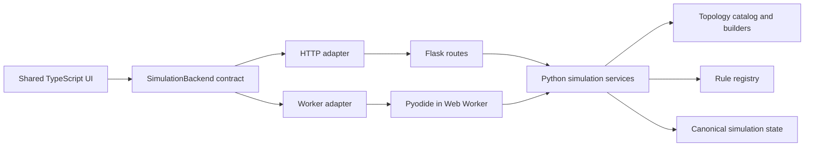

# Design

Status: current design baseline for the development branch. Last audited against
the implementation on August 2, 2026.

This document explains why Cellular Automaton Lab is shaped the way it is. For
current subsystem structure, read [ARCHITECTURE.md](ARCHITECTURE.md). For file
and call-path navigation, read [CODE_MAP.md](CODE_MAP.md).

## Product Problem

Cellular automata are often implemented as algorithms tied to one regular grid.
That makes it difficult to compare the same rule or seed across square,
periodic mixed, and aperiodic neighborhoods. This app instead treats topology
as data: a board supplies stable cells and neighbor relationships, while a rule
evaluates a cell through a shared neighbor context.

The application also needs two useful delivery modes:

- a local server mode with durable Python-owned sessions and an HTTP API
- a static-site mode that can be published to GitHub Pages and used without a
  separately running Python server

The static mode does not remove Python from the system. It runs the same Python
simulation code inside the browser through Pyodide.

## Goals

- Apply one rule protocol across regular, periodic, and aperiodic topologies.
- Keep simulation semantics in one Python implementation across both hosts.
- Let the same TypeScript UI run against either an HTTP backend or a browser
  worker.
- Make topology and rule metadata canonical, inspectable, and testable.
- Support a public static demo without maintaining a second simulation engine.
- Keep mathematical faithfulness, internal geometric validity, and visible
  rendering quality as separate claims with separate evidence.
- Keep the repository usable as a plain Python codebase without Flask or a
  browser when callers only need topology, rules, or simulation services.

## Non-Goals

- A stable public Python, npm, or plugin API during the preview release line.
- Multi-user server collaboration or cloud-synchronized browser preferences.
- Arbitrary untrusted Python execution in the browser.
- Treating every aperiodic family as the same kind of construction.
- Making the generated standalone directory work when opened directly with a
  `file://` URL. Workers, module loading, and fetched assets require an HTTP
  origin, even when that origin is a local static server.

## Architecture At A Glance

The important boundary is not “Python versus browser.” It is the host adapter
around a shared simulation contract. Flask is one adapter. The Pyodide worker
is another.

## Runtime Hosts

| Concern | Server host | Standalone host |
|---|---|---|
| Python execution | CPython process | Pyodide in a Web Worker |
| Transport | Flask HTTP routes | Worker messages using API-shaped paths |
| Simulation authority | Session coordinator | Worker-local runtime |
| Run loop | Backend coordinator thread | Worker timers |
| Simulation persistence | Backend session store | IndexedDB, with `localStorage` fallback |
| UI preferences and saved wall runs | Browser storage | Browser storage |
| Frontend | Shared shell and controller stack | Shared shell and controller stack |
| Deployment | Python process plus built assets | Static HTTP hosting |

The standalone artifact includes the pinned Pyodide runtime, Python standard
library archive, application Python sources, bootstrap metadata, and frontend
assets. It does not need a CDN or other runtime download. It still needs to be
served over HTTP; `python -m http.server` is sufficient for a local artifact.

## Design Decisions

### 1. Make topology a first-class model

Decision: boards store cells aligned to an explicit topology, and rules query a
`RuleContext` instead of indexing a particular grid shape.

Why: the product's defining behavior is comparing one simulation idea across
different neighborhoods. A square-grid-specific engine with special cases for
other tilings would make the catalog increasingly fragile.

Consequences:

- stable cell IDs and adjacency are part of the model contract
- topology construction can be tested independently of simulation and UI
- some topology families need specialized generation and verification paths
- rules that depend on cell kinds must declare compatibility explicitly

### 2. Keep simulation semantics in Python

Decision: Python owns topology construction, rule evaluation, transitions,
snapshot validation, and comparison calculations in both runtime hosts.

Why: the topology implementations and their mathematical verification already
live naturally in Python. Reimplementing them in TypeScript for a static demo
would create two sources of truth and invite host-specific behavior.

Consequences:

- server mode uses normal CPython and can expose a conventional HTTP boundary
- standalone mode pays Pyodide startup and bundle-size costs
- browser-facing Python must avoid dependencies unavailable in the packaged
  Pyodide runtime
- shared payload contracts matter more than framework-specific request objects

### 3. Use Flask as a thin server adapter

Decision: Flask owns route wiring, request/response concerns, app startup, and
server-host asset delivery. Simulation behavior belongs below the Flask layer.

Why: Flask provides a small, direct local HTTP host without forcing the domain
model into a larger web framework. Keeping its routes thin also lets the same
services run in tests, scripts, and Pyodide.

Consequences:

- Flask enables the server-hosted app, not the static standalone app
- request extraction and response wrappers are server-only concerns
- payload normalization and simulation validation must stay framework-neutral
- the plain Python examples can use the simulation stack without constructing a
  Flask application

### 4. Use Pyodide and a Web Worker for static hosting

Decision: the standalone build packages Python sources and a pinned Pyodide
runtime, then runs the simulation in a classic Web Worker.

Why: this preserves one simulation implementation while making the app
deployable as static files. A worker prevents simulation and Python startup
from owning the UI thread.

Consequences:

- there is no separately running Python backend process
- Python still executes locally in the user's browser
- worker startup is heavier than a JavaScript-only application
- worker messages must be serializable and explicitly decoded
- browser-local persistence replaces server session persistence
- operations are serialized within the worker to protect runtime state

### 5. Keep the frontend host-neutral

Decision: frontend controllers depend on `SimulationBackend`, not on `fetch`,
Flask, or Pyodide directly. The worker command paths mirror the HTTP API where
the operations are equivalent.

Why: the UI should not fork into server and standalone implementations. Host
selection happens when the environment is constructed; the controller stack
then follows the same path.

Consequences:

- UI behavior can be exercised against both hosts with shared browser journeys
- HTTP-only behavior, such as server restart persistence, remains host-specific
- payload drift between Python and TypeScript needs contract fixtures and strict
  runtime decoding
- new operations normally require both adapters even when the UI change is
  shared

### 6. Make state ownership and reconciliation explicit

Decision: the active runtime is authoritative for simulation state. The
frontend caches snapshots for rendering and applies only validated, revisioned
deltas.

Why: optimistic local evolution would create competing simulation authorities.
Full snapshots for every cell edit, however, are unnecessarily expensive.

Consequences:

- control mutations return canonical snapshots
- cell mutations may return deltas carrying `base_state_revision`,
  `state_revision`, and `state_epoch`
- a mismatch causes a full-state resynchronization rather than a guessed merge
- revisions are runtime-local and intentionally not persisted

### 7. Share authored shell and bootstrap sources

Decision: `frontend/` is the only authored frontend source tree. Server and
standalone wrappers consume the same shell body, and canonical defaults and
topology metadata are exported from backend-owned sources.

Why: copying HTML, defaults, or catalog metadata between hosts would make
apparently small changes host-dependent.

Consequences:

- `static/dist/` and `output/standalone/` are generated outputs
- Flask injects server bootstrap data, while the standalone build emits JSON
- generated-data freshness is a CI and maintenance concern
- the frontend may have a fallback for startup safety, but it is not an
  independent product configuration

### 8. Separate persistence by ownership

Decision: simulation snapshots are persisted by the active runtime host.
Interface preferences, saved comparison runs, and saved tiling sets are stored
by the browser.

Why: server simulation recovery and user-interface preferences have different
lifetimes and portability expectations. Treating browser storage as a server
database would obscure those boundaries.

Consequences:

- server simulation sessions can survive process restarts through backend
  persistence
- standalone simulation state survives reload through browser storage
- saved UI data remains local to one browser and device
- portable run links are the cross-device sharing format

### 9. Distinguish validation from faithfulness

Decision: geometric validation, source-backed literature verification, and
browser-visible review are separate layers.

Why: a topology can be internally consistent but represent the wrong published
construction, and a mathematically sound patch can still render poorly.

Consequences:

- topology validation answers whether emitted geometry and adjacency are sane
- reference specs state falsifiable family-specific expectations
- known deviations are documented instead of hidden behind a generic pass
- visual promotion of experimental families requires independent review, not
  only fixtures generated from the implementation itself

### 10. Prefer layered tests over browser-only confidence

Decision: pure logic is proven with unit tests, payload boundaries with API and
contract tests, topology claims with validators and reference checks, and real
DOM/canvas/storage behavior with Playwright.

Why: failures should be caught at the cheapest layer that can explain them.
Browser tests are valuable for integration but expensive and imprecise for pure
logic.

Consequences:

- server and standalone share user-flow coverage where behavior should match
- host-specific behavior has focused coverage
- generated standalone freshness is checked before relying on browser results
- a green browser test does not replace mathematical or payload verification

## Alternatives Not Chosen

### Rewrite the standalone simulation in TypeScript

This would reduce startup and bundle weight, but it would duplicate the largest
and most correctness-sensitive part of the codebase. Host parity would become a
continuous comparison problem. The current design accepts Pyodide's cost to
preserve one simulation model.

### Run Flask inside the browser

Flask depends on server-side HTTP and WSGI concepts that do not provide value
inside a worker. The standalone runtime bypasses Flask request and response
objects while reusing framework-neutral payload and simulation contracts.

### Maintain separate server and standalone UIs

This would make each host easier to customize locally but would double product
work and allow visible behavior to diverge. A host-neutral controller boundary
is more constrained but keeps the two delivery modes comparable.

### Store boards as dense rectangular arrays

Dense arrays are simple for square grids but do not naturally represent mixed
faces or finite aperiodic patches. Stable topology cell IDs and sparse state
maps are more general, at the cost of explicit indexing and migration rules.

## Current Constraints And Tradeoffs

- Pyodide increases standalone artifact size and cold-start latency.
- Static mode cannot provide server session isolation or backend restart
  semantics; each worker environment is local to the page.
- Browser storage is not a cross-device account system.
- Some topology families are exact substitutions, some exact-affine
  constructions, some canonical finite patches, and some documented
  deviations. The UI and docs must not imply equal proof strength.
- The preview release line treats repository source and generated artifacts as
  the public integration surface. Compatibility may change before stable
  packaging exists.

## Keeping This Document Current

Update this document when a change alters a product-level constraint, runtime
host, source-of-truth boundary, state owner, persistence owner, or deliberately
chosen tradeoff. Implementation-only movement belongs in
[ARCHITECTURE.md](ARCHITECTURE.md) or [CODE_MAP.md](CODE_MAP.md).

For a new durable decision, add or revise a numbered decision above with:

1. the decision
2. the reason it exists
3. its important consequences
4. any alternative that future maintainers are likely to reconsider

Record completed work in [CHANGELOG.md](../CHANGELOG.md), active follow-up in
[TODO.md](../TODO.md), and structural cleanup priorities in
[CODE_QUALITY_ROADMAP.md](CODE_QUALITY_ROADMAP.md).
